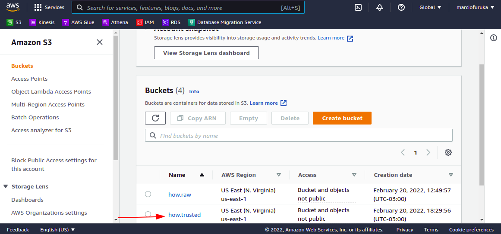
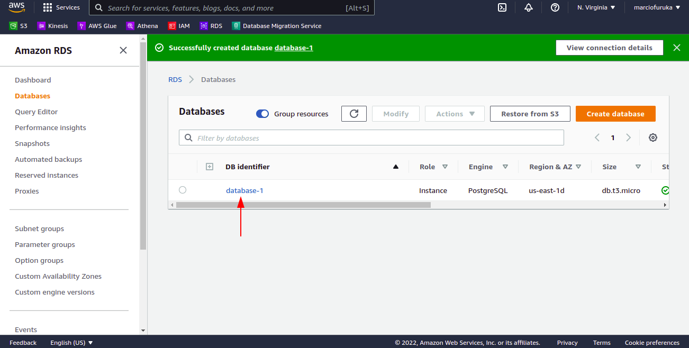
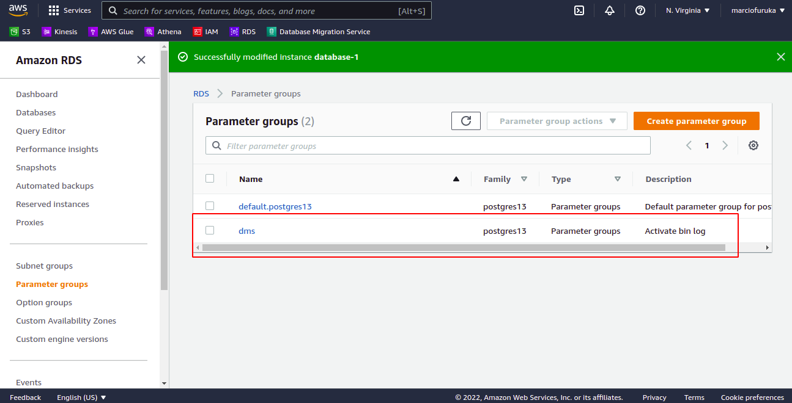
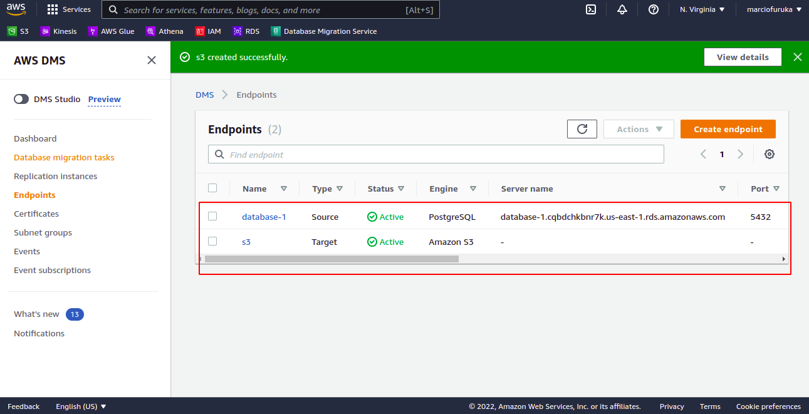
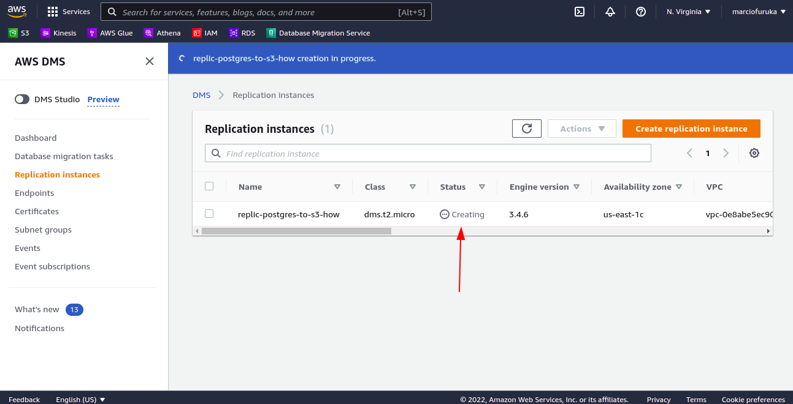
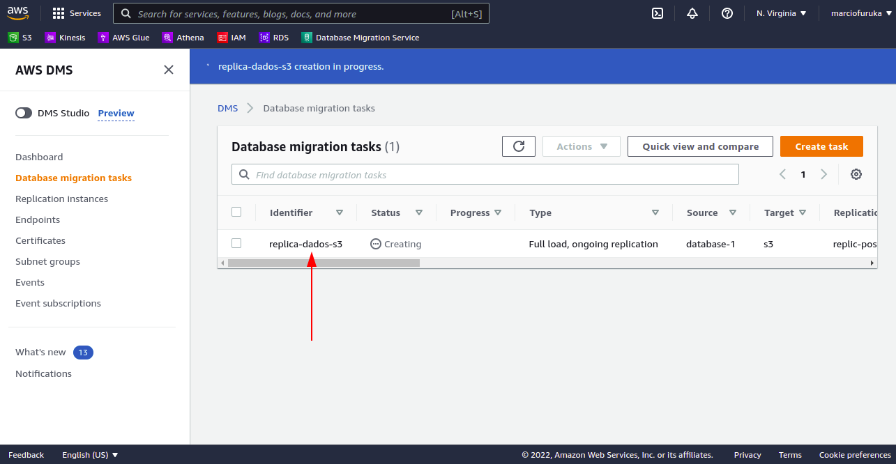
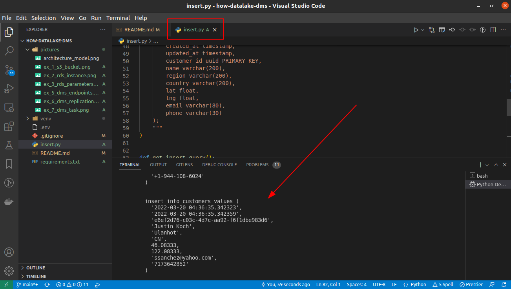
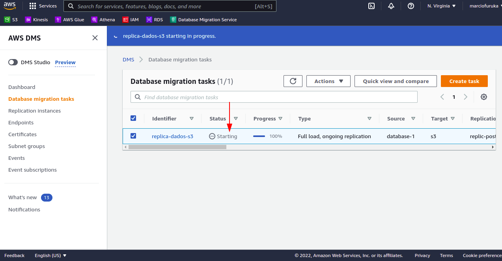

# how-datalake-dms

Created for studying and reproduce some exercises during the [How Edu](https://howedu.com.br/) Bootcamp.
Here we're using AWS services:

- S3
- RDS
- DMS

It's a low-code solution using the Amazon Web Services.

# Architecture Model


# How it works

In this repository we have a sample (step by step) of configure the Amazon Web Services to integrate a RDS Database to S3 Bucket using DMS.

The fake data are generated randomly using the python code that has gotten from André Sionek's Github [here](https://github.com/andresionek91/dms-insert-update/).

The python code generate data inserting into RDS Database, the DMS capture the data in "almost" real-time and insert them into a S3 bucket.

# Exercise and AWS configurations step-by-step

1. Create a S3 bucket:
   - Block public access
   - Enable bucket versioning
   - Enable encryption (SSE-S3)



2. Create a free tier RDS instance:
   - Choose PostgreSQL as engine
   - Enable public access



3. Create a new parameter group to PostgreSQL 13:
   - `rds.logical_replication = 1`
   - `wal_sender_timeout = 0`
   - Edit RDS instance and associate the parameter group created
   - Reboot the RDS instance



4. Create a new DMS Role in IAM
   - Keep AWS Service
   - Choose "DMS" in Use Cases
   - Next and click on Create Policy
     - Add the following JSON replacing the ARN of the S3 Bucket:

```json
{
  "Version": "2012-10-17",
  "Statement": [
    {
      "Effect": "Allow",
      "Action": ["s3:PutObject", "s3:DeleteObject", "s3:PutObjectTagging"],
      "Resource": ["arn:aws:s3:::how.raw/*"]
    },
    {
      "Effect": "Allow",
      "Action": ["s3:ListBucket"],
      "Resource": ["arn:aws:s3:::how.raw"]
    }
  ]
}
```

5. Database Migration Service Endpoints:
   - Create source endpoint selecting the RDS instance created
     - Provide access information manually
     - Endpoint settings: add new setting
       - `CaptureDdls = true`
   - Create target endpoint selecting the S3 bucket
     - Paste the ARN of the Role created
     - Paste the S3 Bucket name
     - Add an Extra connection attributes in Endpoint settings: `DataFormat=parquet;maxFileSize=131072;timestampColumnName=extracted_at;includeOpForFullLoad=true;cdcMaxBatchinterval=120`



6. Database Migration Service Replication instance:
   - Create a Replication instance
     - Instance class: dms.t2.micro
     - VPC: the same as RDS
     - Multi AZ: Single-AZ
     - Publicly accessible: false



7. Database Migration Service Task:
   - Link all objects created (replication instance, source and target endpoints)
   - Migration type: Migrate existing data and replicate ongoing changes
   - Table mappings:
     - Click on Add new selection rule
     - Schema: Enter a schema
     - Schema name: %



8. Run the André Sionek python code
   - Don't forget to configure the RDS access credentials and hostname.



9. Start the task.


