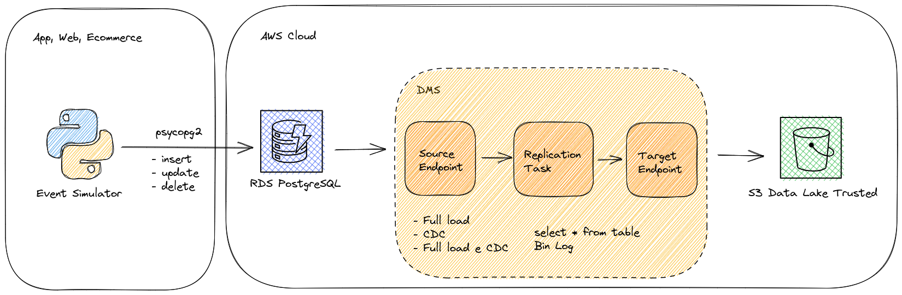

# how-datalake-dms

Created for studying and reproduce some exercises during the [How Edu](https://howedu.com.br/) Bootcamp.
Here we're using AWS services:

- S3
- RDS
- DMS

# Architecture Model

# How it works

[blah]

# Exercise and AWS configurations step-by-step

[blah]
